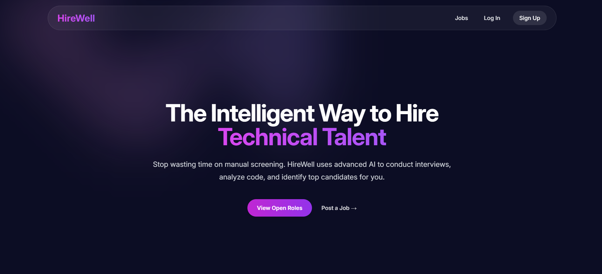
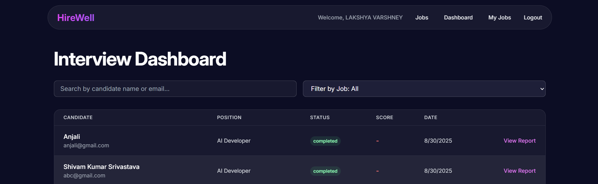
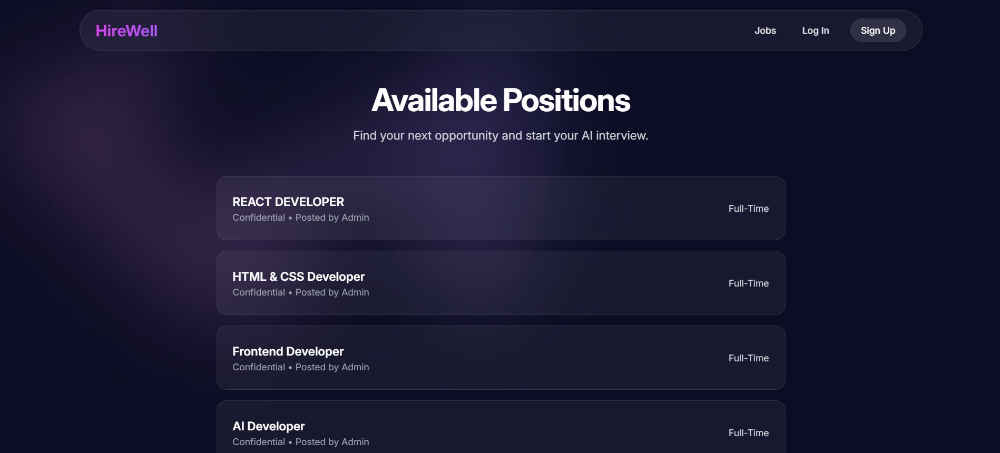

# 🎯 HireWell – The Smart Job Portal

<p align="center">
  
  
  
  
  
  
</p>

<p align="center">
  <b>HireWell is a full-stack job portal connecting students 🎓 with recruiters 🧑‍💼.</b><br>
  Built with <b>MVC architecture</b>, it’s lightweight, scalable, and future-ready with <b>AI-driven recruitment</b> features on the roadmap.
</p>

---

## 🌐 Live Demo

<p align="center">
  <a href="https://hirewellfront.azurewebsites.net" target="_blank">
    
  </a>
</p>

👉 [**Click here to explore HireWell live**](https://hirewellfront.azurewebsites.net)

---

## ✨ Features

### 👔 Recruiter Workflow

* 🔐 Secure signup & login
* 📊 Dashboard to manage job postings
* 📝 Create & edit job listings
* 👀 View applicants in one place

### 🎓 Student Workflow

* 🔐 Secure signup & login
* 🔎 Browse all active job listings
* ⚡ One-click apply to any job
* 📌 Track applied jobs

---

## 🏗️ Architecture Overview

```
HireWell
 ├── app.js              # Main Express app
 ├── models/             # MongoDB schemas (User, Job, etc.)
 ├── routes/             # Route handlers
 ├── views/              # EJS templates (UI)
 ├── public/             # Static files (CSS, images)
 ├── config/             # Passport.js, DB config
 ├── package.json        # Dependencies & scripts
```

---

## 💻 Tech Stack

| Layer        | Tech Used                              |
| ------------ | -------------------------------------- |
| **Frontend** | EJS (server-side rendering), CSS       |
| **Backend**  | Node.js, Express.js                    |
| **Database** | MongoDB, Mongoose                      |
| **Auth**     | Passport.js (Local strategy, sessions) |
| **Hosting**  | Azure App Service                      |

---

## ⚡ Quick Start

1️⃣ Clone the repo

```bash
git clone https://github.com/your-username/HireWell.git
cd HireWell
```

2️⃣ Install dependencies

```bash
npm install
```

3️⃣ Setup environment variables (`.env`)

```env
MONGO_URI=your_mongodb_connection_string
SESSION_SECRET=your_secret_key
```

4️⃣ Start the server

```bash
npm start
```

👉 Visit **[Link to HireWell](https://hirewellfront.azurewebsites.net/)**

---

## 🚀 Future Roadmap

✨ AI-powered recruitment upgrades:

* 🤖 **Voice-Based AI Interviews** – Automated candidate screening
* 💻 **AI-Powered Coding Rounds** – Real-time coding assessments
* 📊 **Sentiment Analysis Feedback** – AI-driven insights
* 🌐 **Multilingual Support** – Interview in multiple languages
* 🔗 **ATS Integration** – Enterprise-ready HR integrations

---

## 📸 Screenshots

<p align="center">
  <table>
    <tr>
      <td align="center"><b>🏠 Home Page</b></td>
      <td align="center"><b>👔 Recruiter Dashboard</b></td>
      <td align="center"><b>🎓 Student Job Board</b></td>
    </tr>
    <tr>
      <td></td>
      <td></td>
      <td></td>
    </tr>
  </table>
</p>

---

## 🤝 Contributing

Contributions are **welcome & appreciated**!

* Fork this repo 🍴
* Create a new branch 🌱
* Submit a PR 🚀

---

## 📜 License

This project is licensed under the **MIT License**.

---

## 👨‍💻 Made By

<p align="center">
  <b>💡 HireWell was designed & built by <a href="https://github.com/lakshya051">Lakshya Varshney</a></b>
</p>  

---

🔥 With HireWell, finding the right opportunity or candidate becomes **simpler, smarter, and faster**.

